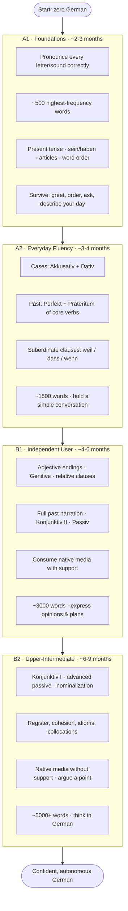
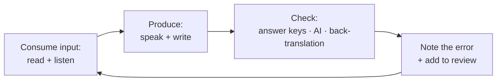

# Sprachheft — The Learner's Guide

*How to go from zero to confident German (A1 → B2) on your own, using this app.*

This is the "why" and "how" behind the course content. The app gives you the
material and the daily review; this guide gives you the **method** — what to
study, how often, how to space it across the day and week, how it should evolve,
and how to build listening and pronunciation without a conversation partner.

Read it once now. Come back to it whenever a plateau appears.

---

## 1. The seven principles (read these first)

Everything below is built on how language is actually acquired. If you only
remember seven things, remember these.

1. **Consistency beats intensity.** 30 focused minutes every day beats 4 hours
   on Sunday. Language lives in habit, not in heroics.
2. **Comprehensible input drives acquisition.** You grow by understanding
   messages slightly above your level (*i+1*): mostly-known material with a few
   new pieces. Not too easy, not a wall.
3. **Retrieval, not review.** You learn by *pulling* words out of memory (a quiz,
   a blank, saying it aloud), not by *re-reading* them. Struggling to recall is
   the workout. That is why the app tests you instead of just showing lists.
4. **Space it out.** Meeting a word 6 times across 6 days beats 6 times in one
   hour. The daily review (FSRS) schedules this for you — trust it.
5. **Output forces real learning.** Reading a rule is passive; *producing* a
   sentence exposes what you actually can't do yet. Speak and write early, badly,
   often.
6. **Interleave, don't block.** Mixing cases, tenses, and topics in one session
   builds flexible recall. Doing 50 identical drills in a row feels good and
   teaches little.
7. **Frequency first.** The most common ~1,000 words cover most everyday speech.
   Learn common words and structures *before* rare, pretty ones.

> The app is built around 2–4 (spaced retrieval) and 5 (output via writing +
> interpretation exercises). Your job is to supply 1, 2, 6, and 7 with your
> daily habit and material choices.

---

## 2. What to study — the five pillars

Real fluency is five skills braided together, not "grammar." Every week should
touch all five. Neglect one and it becomes the ceiling on the others.

| Pillar | What it is | Where in the app |
|---|---|---|
| **Vocabulary** | High-frequency words first, then words from media you like | Vocab library, daily review, dictionary lookups |
| **Grammar** | The A1→B2 taxonomy, one topic at a time | Grammar exercises, taxonomy topics |
| **Listening** | Understanding real speech at natural speed | Materials (video/podcast) + interpretation exercises |
| **Speaking / Pronunciation** | Making the right sounds and rhythm out loud | Shadowing materials, reading answers aloud |
| **Writing / Production** | Composing your own correct sentences | Writing & interpretation exercises, translation |

A useful weekly weighting for most learners:

- **Vocabulary 30%** · **Listening 25%** · **Grammar 20%** · **Speaking 15%** · **Writing 10%**

Shift toward listening and speaking as you climb (see §6).

---

## 3. How often — the daily habit

**Non-negotiable: study every day, even if only 10 minutes.** The streak
protects the memory schedule; a missed day lets due words pile up and decay.

Two versions of a day — pick based on the time you truly have:

### The minimum day (~20–25 min, protects the streak)
- **10 min** — clear the daily review queue (spaced repetition).
- **10 min** — one exercise block on the current grammar topic.
- **1 min** — read one example sentence aloud before you close the app.

### The ideal day (~60–75 min, real progress)
Split into 2–3 sessions, not one block (spacing works *within* a day too):

| Slot | Minutes | Focus |
|---|---|---|
| **Morning** | 15 | Daily review queue first — recall is sharpest, and it "unlocks" the day's words |
| **Midday** | 25 | New input: a grammar topic + its exercises, or a new material with generated exercises |
| **Evening** | 20 | Listening + speaking: watch/listen to a material, then shadow it (§7–8) |
| **Bedtime** | 5 | Skim tomorrow's target; read 3 sentences aloud. Light exposure before sleep aids consolidation |

**Why split it:** three 20-minute touches beat one 60-minute block for memory,
and short sessions are easier to actually start. Momentum is the whole game.

> **Rule of the queue:** always do the **review** before anything new. Old words
> are the foundation; don't build a new floor while the one below crumbles.

---

## 4. How to distribute it across the week

Don't do "a bit of everything, every day" *identically*. Give days a lead role so
each pillar gets deep focus, while the daily review keeps everything warm.

A sustainable weekly rhythm:

| Day | Lead focus | What it looks like |
|---|---|---|
| **Mon** | New grammar | Introduce the week's grammar topic + first exercises |
| **Tue** | Vocabulary + input | New material, extract & drill its vocab |
| **Wed** | Grammar consolidation | Harder exercises on Monday's topic; mix in old topics (interleave) |
| **Thu** | Listening | Longer listening session + shadowing; interpretation exercises |
| **Fri** | Writing / output | Write 5–10 sentences using the week's grammar & vocab; get them checked |
| **Sat** | Immersion | 30–60 min of German media *for enjoyment* — film, podcast, YouTube, a song |
| **Sun** | Review + reflect | Clear backlog, redo missed exercises, note weak spots, plan next week |

Keep the **daily review** on *every* day, including Saturday and Sunday. It's the
spine that holds the week together.

**The immersion day matters more than it looks.** One weekly session of "German
for fun, understanding is optional" trains your ear for real rhythm and keeps
motivation alive. Choose content you'd enjoy in your own language.

---

## 5. The map for success

The journey has four stations. Each builds on the last; skipping ahead creates
gaps that surface later as a plateau.

Time ranges assume ~45–60 min/day. Faster or slower is fine — **the order matters
more than the pace.** Don't chase the next level; chase *stability* at the one
you're on. You're ready to move up when the current level's exercises feel
boring, not hard.

### The three dials you turn as you climb

The app encodes two of these directly (LEVEL and STAGE); the third is your habit.

1. **LEVEL (A1→B2)** — *how hard the German is.* Raise it when the content bores you.
2. **STAGE (1→4)** — *how much help you get*, and it **shrinks over time:**
   - `1` just introduced → max hints, word banks, English support, multiple-choice.
   - `2` practising → partial hints.
   - `3` confident → German instructions, at most a short tip.
   - `4` consolidating → German only, no hints, free production.
   - **Turn a topic's STAGE up as it becomes familiar** — this removes the
     training wheels on *your* schedule, per topic.
3. **AUTONOMY** — *how much you generate yourself.* Early on you follow the
   course; later you feed in your own media and let the agent build exercises
   from what *you* care about.

---

## 6. How the plan evolves over time

The *method* changes as you climb, not just the difficulty. Early German is about
**building blocks under bright light**; later German is about **living in the
language.**

| | Early (A1–A2) | Middle (B1) | Advanced (B2+) |
|---|---|---|---|
| **Vocabulary** | Frequency lists, everyday words | Topic & media words | Collocations, idioms, register |
| **Grammar** | Explicit rules + drills | Rules in context | Notice & self-correct; nuance |
| **Input** | Graded / slowed, with transcript | Native media *with* support | Native media, no support |
| **Output** | Fixed sentences, translation | Guided writing, opinions | Free essays, argument, debate |
| **Language of study** | English scaffolding | Mixed | German-only (think in German) |
| **Correction** | Every error flagged | Patterns flagged | Self-editing, style |
| **Scaffolding (STAGE)** | 1–2 | 2–3 | 3–4 |

**The big shift happens around B1:** you stop "studying German" and start "doing
things in German." Grammar becomes something you *notice* in real input rather
than something you memorize in the abstract. That's the transition from *student*
to *user* — and it's exactly when most people quit, right before it gets good.
Push through B1; it's the hump.

---

## 7. Pronunciation — sound like you mean it

Fix pronunciation **early**. Bad habits set fast and cost far more to undo later
than to learn right the first time. You don't need to be perfect — you need to be
*clearly understood* and to hear the difference between sounds (which also makes
you understand *others* better).

### The German sounds that trip up English speakers

| Sound | How | Practice words |
|---|---|---|
| **ü** | Say "ee," then round your lips as if for "oo" — hold the tongue forward | über, Tür, für, müde, Bücher |
| **ö** | Say "eh," then round your lips | schön, hören, können, möchte |
| **ä** | Like "e" in *bed* (long: like *air*) | Mädchen, spät, Universität |
| **ch** (ich-sound) | Soft hiss, tongue high & front — like a whispered "h" in *huge* | ich, nicht, Milch, richtig |
| **ch** (ach-sound) | Rasp at the back of the throat, after a/o/u | ach, Buch, machen, Nacht, auch |
| **r** | Uvular — a light gargle at the back; **not** the English/rolled r | rot, Frau, sprechen |
| **-er / -r** ending | Vocalized to a soft "uh," not a hard r | Vater, Mutter, besser, wir |
| **z** | Always /ts/, as in *cats* | Zeit, zusammen, zehn, Zug |
| **w** | Like English **v** | Wasser, wollen, wir, Wein |
| **v** | Usually like English **f** | Vater, viel, von, vier |
| **st- / sp-** | At word start: "sht-" / "shp-" | Straße, Stadt, spielen, sprechen |

### The patterns that quietly mark a foreigner

- **Final devoicing:** letters `b d g` at the end of a word sound like `p t k`.
  *Tag* → "Tak," *und* → "unt," *Hund* → "Hunt," *gelb* → "gelp."
- **Long vs short vowels change meaning:** *Staat* (long) vs *Stadt* (short),
  *ihn* vs *in*, *Beet* vs *Bett*, *Ofen* vs *offen*. A vowel is long before `h`
  or a single consonant, short before a double consonant.
- **The glottal stop:** German restarts cleanly before an initial vowel — a tiny
  catch in the throat. *ein Ei*, *ver·eisen* ≠ *verreisen*. It gives German its
  crisp, staccato feel.
- **ei vs ie:** *ei* = "eye" (*mein, Zeit*); *ie* = "ee" (*wie, Liebe*). Say the
  **second** letter's name — a reliable trick.

### Techniques that actually build pronunciation (solo)

1. **Shadowing** — the single most powerful tool. Play one sentence, then say it
   *simultaneously* or immediately after, copying melody, speed, and stress — not
   just the words. Loop the same 30–60 seconds until it feels automatic.
2. **Minimal-pair training** — drill sounds you can't yet hear apart, in pairs:
   *Staat/Stadt · ihn/in · Kiste/Küste (i/ü) · können/kennen (ö/e) · Hüte/Hütte ·
   Rad/Rat.* Being able to *hear* the difference is what lets you *make* it.
3. **Record and compare** — record yourself reading a line, then play the native
   version and your version back to back. The gap you hear is your to-do list.
   Do this weekly; it's humbling and it works.
4. **Chorusing** — read aloud *along with* a native track, staying glued to their
   rhythm. Great for prosody (the music of the sentence).
5. **Exaggerate, then relax** — over-pronounce the hard sounds (ü, ö, ch, r)
   deliberately in practice. Your "too much" is usually just "about right."
6. **Learn the rhythm, not just the sounds** — German stresses word *stems* and
   has a strong beat. Getting the melody right makes you sound fluent even with
   imperfect sounds.

**Daily dose:** 5 minutes of shadowing at the end of a listening session. Use a
text-to-speech voice or any material's audio as your model, and the offline
dictionary to check a word's stress when unsure.

---

## 8. Listening — from noise to meaning

Listening is the skill most people under-train and then panic about. It grows in
two complementary ways — do both.

### Two modes of listening

- **Intensive (understand every word):** short clips (30–90 s). Listen, look at
  the transcript, look up unknowns, listen again until it's fully clear. This is
  *study*. Use the interpretation exercises the app generates from a material to
  check real comprehension.
- **Extensive (understand the gist, high volume):** long, enjoyable content where
  you let unknown words wash past. This is *exposure*. Quantity trains your ear to
  natural speed and connected speech.

You need both: intensive builds precision, extensive builds fluency and stamina.

### A listening ladder (climb as you level up)

| Level | What to listen to |
|---|---|
| **A1** | Slow-German podcasts, children's shows, textbook audio, TTS of your own sentences |
| **A2** | *Nachrichten leicht / in einfacher Sprache* (slow news), graded readers with audio, simple vlogs |
| **B1** | Native podcasts on familiar topics, dubbed shows with German subtitles, YouTube creators |
| **B2** | News, interviews, films, audiobooks — no subtitles, any topic |

### Techniques that build the ear (solo)

1. **Repeat listening** — the same clip 3–5 times beats five different clips once.
   Each pass, more resolves from noise into words.
2. **Transcription / dictation** — play a sentence, write down exactly what you
   hear, then check against the transcript. Ruthlessly exposes the sounds you're
   missing (often *the*, endings, and swallowed function words).
3. **Subtitle staircase:** native audio → German subtitles → no subtitles. Never
   rely on English subtitles for study; they let your brain switch German off.
4. **Slow it down, then speed it up** — 0.75× to decode, then 1× (or 1.25×) to
   normalize. Real speech is faster and more slurred than textbook audio; train
   for it deliberately.
5. **Listen to things you'll re-listen to** — a favorite song, a podcast you love.
   Repetition you *enjoy* is repetition you'll actually do.
6. **Pre-load vocabulary** — skim a material's generated vocab *before* listening.
   Knowing the words in advance makes the audio suddenly "click."

**Feed your own media in.** The whole point of the app: paste a transcript or link
to something *you* want to understand, let the agent extract vocab and build
listening/interpretation exercises. Motivation from real content beats any
textbook.

---

## 9. How to learn without a partner

You do **not** need a conversation partner to reach B2. You need to *produce*
language and *get feedback*. Here's how to manufacture both alone.

### Manufacture speaking practice

- **Self-talk / narrate your life.** Describe what you're doing, in German, all
  day: *"Ich mache jetzt Kaffee. Der Kaffee ist heiß."* It turns dead time (cooking,
  walking, commuting) into practice and reveals exactly which everyday words you're
  missing — look those up.
- **Think in German.** Push your inner monologue into German for 5 minutes at a
  time. When you hit a wall, that gap is your next lesson.
- **The monologue drill.** Once a day, speak for 60 seconds on a prompt (*my
  weekend, my job, why I'm learning German*). Record it. Do it again next week and
  hear the growth.
- **Shadowing as a speaking substitute** (§7). It's speaking practice with a
  built-in perfect model — arguably better than a beginner conversation for
  building sound and rhythm.

### Manufacture feedback

- **Writing is speaking you can check.** Write daily — even 3 sentences. Use the
  app's **writing** and **interpretation** exercises; they're designed for
  production and come with sample answers and rubrics to grade yourself against.
- **Use an AI chat as a tutor.** Ask it to correct your text, explain *why*, give
  you a harder version, or role-play a scene (ordering food, a job interview).
  It's an infinitely patient partner, available at 2 a.m. Ask for corrections in
  German once you're B1+.
- **Translate both ways.** Translate a short English text to German, then back —
  compare to the original to catch errors. The app's translation exercises do this
  with answer keys.
- **Async exchange, later.** When you're ~A2+, apps like language-exchange
  platforms let you swap voice messages with natives on your own schedule — the
  social benefit of a partner without needing one live.

### Your solo feedback loop

The engine of solo learning is this loop: **input → output → feedback → fix**,
with the fixes fed back into your spaced review so you don't make the same mistake
twice. Turning that crank daily is the entire method.

---

## 10. Which elements to introduce over time

Add complexity in order. Each row assumes the ones above are becoming comfortable.
This is a checklist for expanding your *practice*, in step with the grammar
taxonomy.

| Introduce when… | Add this element | Why then |
|---|---|---|
| **Day 1** | Correct pronunciation of every sound; 20 survival phrases | Habits set now; phrases give instant wins |
| **Week 1** | Daily spaced review; reading example sentences aloud | Build the habit spine and the speaking reflex early |
| **Week 2–3** | Shadowing short clips; frequency vocabulary | Ear + mouth training from the start |
| **~A1 mid** | Intensive listening (short clips + transcript) | You now know enough words for it to pay off |
| **~A1 end** | Daily writing (3–5 sentences); self-talk narration | First real output, low stakes |
| **~A2 start** | Interpretation/comprehension exercises; extensive listening for fun | Shift from words to *meaning* |
| **~A2 mid** | AI chat role-plays; raising STAGE to reduce hints | Push toward production and independence |
| **~A2 end** | Your own media (paste transcripts/links) as source | Motivation + real language |
| **~B1** | Native media *with* support; opinion writing; think-in-German blocks | Become a *user*, not a student |
| **~B1 end** | Async speaking exchange; longer free writing | Real interaction, on your schedule |
| **~B2** | Native media *without* support; essays/arguments; register & idioms | Nuance, style, and thinking *in* German |

**Golden rule of sequencing:** never practice a structure in the wild before
you've met it in a lesson, and never let a new element crowd out the daily review.
Add one new element at a time and let it settle before adding the next.

---

## 11. Common traps (and the fix)

| Trap | Fix |
|---|---|
| **Passive re-reading** (feels productive, isn't) | Force *recall*: hide the answer, say it first, then check |
| **Grammar hoarding** — endless rules, no output | Every rule learned → produce 5 sentences with it today |
| **Tutorial hell** — always "starting over" at A1 | Pick the plan and climb; boredom, not fear, signals "level up" |
| **Skipping pronunciation** to save time | 5 min/day of shadowing now saves months of retraining later |
| **English subtitles** as a crutch | German subtitles or none; English = German brain off |
| **Streak-breaking** on busy days | Do the 10-minute minimum day; protect the chain above all |
| **Ignoring the review queue** to do "fun" new stuff | Review *first*, always; the foundation before the new floor |
| **Perfectionism** — afraid to speak/write badly | Errors are data. Produce badly, get feedback, fix, repeat |

---

## 12. Your one-page routine

Pin this somewhere.

**Every day**
1. Clear the **review queue** first (10–15 min).
2. One **new** thing: a grammar topic *or* a material with exercises (20–25 min).
3. **Listen + shadow** a short clip out loud (10 min).
4. Write or say **3 sentences** using today's material (5 min).
5. Feed every mistake back into review.

**Every week**
- Lead each day with one pillar (Mon grammar → Sun review — see §4).
- One **immersion** session in German you enjoy.
- One **recording** of yourself; compare to last week.
- Reflect Sunday: what was hard? That's next week's focus.

**Every level**
- Turn the **STAGE** dial up as topics get familiar (fewer hints).
- Raise the **LEVEL** when the current one bores you, not when it merely scares you.
- Shift the balance from *drills* toward *living in the language*.

---

*The plan is simple; the discipline is the hard part. Show up every day, keep the
loop turning — input, output, feedback, fix — and B2 is not a question of talent.
It's a question of Tuesdays. **Viel Erfolg!***
